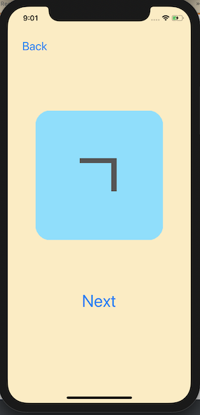

# KoreanAlphabetApp

A flashcard style iOS application used to practice memorizing the Korean alphabet. Card sets include consonants, vowels and consonant names.

{:height="415px" width="855px"} 

{:height="285px" width="591px"}
