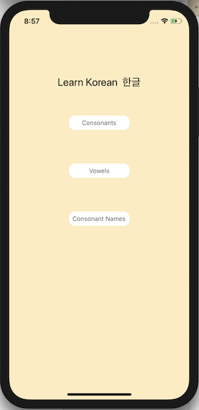

# KoreanAlphabetApp

A flashcard style iOS application used to practice memorizing the Korean alphabet. Card sets include consonants, vowels and consonant names. It's a side project for fun.

           
